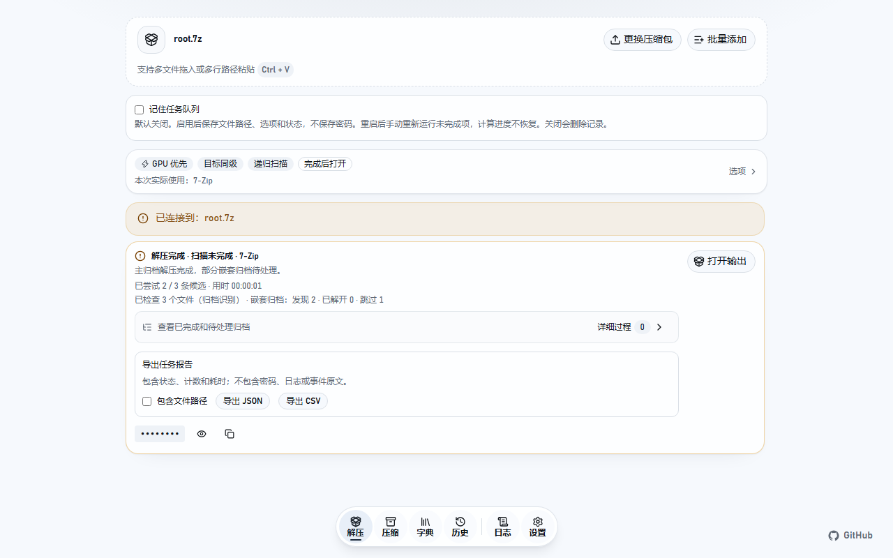

<p align="center">
  <a href="./README.en.md">English</a> | <strong>简体中文</strong>
</p>

<div align="center">

# ArcRecall

用于识别真实文件格式、修复异常后缀并处理嵌套压缩资源的本地优先桌面工具。

<p><a href="https://www.rust-lang.org/"></a> <a href="https://v2.tauri.app/"></a> <a href="https://nextjs.org/"></a> <a href="https://react.dev/"></a> <a href="https://ui.shadcn.com/"></a> <a href="./LICENSE"></a></p>

</div>

## 下载与首次使用

Windows x64 安装包入口：[GitHub Releases](https://github.com/ZhongYanZhiShi/ArcRecall/releases)。
选择完整引擎版安装包；若页面尚无可下载版本，可按下方开发说明运行或执行 `pnpm desktop:build` 构建。
浏览器预览仅用于界面开发，实际文件处理需要桌面版；macOS/Linux 暂无经过验证的发行包。

1. 启动桌面版，在「设置 → 解密引擎」安装完整包，确认 7-Zip 就绪。没有 GPU 时可选「仅 CPU」。
2. 拖入自己创建的测试归档，例如包含 `hello.txt`、密码为 `demo-password` 的 `example.7z`。
3. 在「已知密码」填入密码，保持默认同级输出目录，点击「开始恢复并解压」。
4. 在结果中打开输出目录；若有跳过或待处理归档，可在「详细过程」勾选并加入重试队列。



截图使用合成归档信息，密码默认隐藏。

## 格式与分卷支持

| 类型        | 识别与恢复                                         | 分卷边界                                             |
| ----------- | -------------------------------------------------- | ---------------------------------------------------- |
| 7z          | 内容识别、已知密码验证、字典恢复、递归解压         | 支持连续数字分卷及可解析的异常后缀分卷；缺卷会报错   |
| ZIP / ZIP64 | 内容识别、已知密码验证、字典恢复、递归解压         | 支持 `.z01 … .zip`、`.zip.001 …`；需完整且一致的卷组 |
| RAR3 / RAR5 | 单文件识别、验证与恢复；具体加密形式受引擎支持限制 | 多分卷恢复及完整卷组历史指纹尚未完整支持             |
| LZ4 Frame   | 解包内部受支持的归档，执行展开预算检查             | 不是通用 LZ4 文件管理器                              |
| 创建归档    | 7z、ZIP，可设置密码                                | 暂不提供分卷压缩                                     |

GPU 恢复需要可用的 Hashcat 设备；「仅 CPU」不要求 GPU。错误后缀不会修改原文件，
「生成正确后缀副本」创建独立副本。文件识别成功不代表归档完整或密码已找到。

## 项目简介

有些网络资源会被删除文件后缀、改成与真实格式无关的后缀，或封装在多层加密压缩包中。系统无法直接识别这类文件，用户只能猜测格式并逐层尝试解包。

ArcRecall 会读取文件内容来判断真实格式，补回或修正后缀，并逐层处理嵌套压缩包。遇到加密文件时，密码验证在本机进行。Next.js 前端负责交互，Tauri 负责原生桌面生命周期和 IPC 边界，与平台无关的 Rust 核心负责文件识别与归档处理。

## 主要功能

- 根据文件签名和内部结构识别真实格式
- 逐层分析和解包嵌套压缩文件
- 在本机检测加密并验证密码
- 保存处理记录，方便后续查看
- 本机结构化运行日志、诊断导出与 SQLite 备份
- 批次队列：多选、拖入多个文件或粘贴多行路径，按顺序解压并保留每项结果
- 勾选未完成的嵌套归档加入重试队列，可选跨重启找回任务列表
- 导出 JSON / CSV 任务报告，默认不含文件路径，始终排除密码与原始日志
- 生成正确后缀的独立副本，分卷归档一起复制并规范命名
- 字典导入进度与取消、Hashcat 实时进度和速度

批次最多接收 200 项，停止批次后保留等待项，可将失败或取消项重新排队。
每项归档都使用独立输出目录，批次的优先密码仅用于本次处理，不保存到浏览器存储。
Hashcat 的完成比例是当前引擎尝试的进度，切换模式或处理下一个嵌套归档时会重新开始。

嵌套压缩包扫描默认跳过直属文件超过 10 个的目录及其子目录，其他同级目录继续扫描，
已解压内容保留。可在「设置 → 解密引擎 → 目录扫描文件数上限」调整，设为 0 则不限文件数；
保存后对新任务生效。跳过原因会显示在详细过程与完成摘要中。

解压完成与扫描覆盖分别显示。当前会话中最近的任务可直接补扫未扫描目录，本次补扫不限
直属文件数，并保留原层级、继承密码、待处理归档和剩余磁盘预算；无需再次解压外层归档，
也不会处理首次解压前就存在且未变化的归档。补扫状态不跨应用重启保存。
详细过程还提供各阶段累计耗时、未扫描目录和最终内容目录入口；连续扫描进度合并显示。
「打开最终内容目录」只定位目录，不移动或扁平化文件。

## 任务记忆与报告

「记住任务队列」默认关闭。启用后，单项启动和批次任务都写入
`%LocalAppData%\ArcRecall\recovery-queue.json`，保存来源路径、选项、状态，以及各卷大小和修改时间。
密码、任务日志和事件不写入此文件。关闭开关会删除记录；清空队列也会同步清空保存的任务。
该文件独立于 SQLite 字典/历史备份。

重启后不会自动启动任务。原来正在处理的项恢复为等待项，已完成项保持完成状态；
需要时重新输入密码，再手动开始。源文件缺失或各卷大小、修改时间变化会阻止执行，需移除后重新添加。
此检查不是完整内容指纹，不检测刻意保持大小和时间不变的内容修改。
恢复会从头运行，并使用避让已有内容的新输出目录；不恢复 Hashcat 计算进度或递归补扫游标。
异常退出前未完成的保存可能丢失，请在重新运行前核对输出目录。

在结果卡片中选择「导出 JSON」或「导出 CSV」，报告保存到本机数据目录的 `exports`。
报告包含状态、归档数量、扫描覆盖与阶段耗时；默认不含路径，按需勾选「包含文件路径」。
报告不含密码、错误消息原文或事件日志。CSV 对公式起始字符转义，可用于表格查看。

## 回归验证

```powershell
pnpm test                         # 逻辑与工作流测试，不启动桌面
pnpm build
pnpm exec playwright install chromium
pnpm test:ui                      # 真实 React DOM，桌面 IPC 使用测试替身
cargo test --workspace --all-targets --all-features

# 在已配置 MSVC 的终端运行；须有 Windows WebView2 和 7-Zip
$env:CARGO_TARGET_DIR = Join-Path (Get-Location) 'target/native-e2e'
pnpm exec tauri build --debug --no-bundle
pnpm test:desktop                 # 真实 Tauri / WebView2 / Rust IPC / 7-Zip
```

原生测试在临时目录创建合成归档和独立应用数据，验证重启恢复、来源变化、实际解压、报告、取消与窗口退出清理，
不操作日常使用的数据库或系统剪贴板。7-Zip 默认位于 `C:\Program Files\7-Zip\7z.exe`，
可用 `ARC_RECALL_TEST_7ZIP` 指向其他安装目录；仅使用 debug 测试构建。
截图和失败追踪位于 `test-results`，隔离数据目录会打印到终端并保留供检查。
浏览器测试不能替代原生集成测试。CI 分别运行这两层验证。

真实 Hashcat 候选回归需额外准备独立引擎目录和可用 GPU：

```powershell
$env:ARC_RECALL_TEST_HASHCAT = 'C:\test-tools\hashcat\hashcat.exe'
cargo test -p arc-recall-core real_hashcat_preserves_literal_utf8_and_whitespace_passwords -- --ignored
```

此测试验证真实 Hashcat 输入/输出链路中的 `$HEX[...]` 字面量、中文和首尾空格。
只运行上述指定用例；其他忽略的性能分析用例可能需要手动配置真实归档。

每个恢复任务共享累计展开预算：最多 100 GiB、100,000 个文件或目录。LZ4 解码和分卷复制回退
也计入字节预算；Windows 会在解压前检查目标磁盘空间，解压期间定期检查实际输出和
剩余空间，并保留至少 256 MiB。每次检查完成后至少间隔 500 ms，扫描过程中可取消。
运行时检查可能有短暂超出；达到预算后停止递归，保留完成部分。
其他平台执行累计预算检查，目前不提供磁盘空余空间查询。

## 恢复历史

成功处理的根归档和嵌套归档会按完整归档内容生成 SHA-256 指纹并写入 SQLite；识别出的
多分卷会按确定顺序纳入同一指纹。恢复任务启动后会在后台计算该指纹并查找历史密码，
因此文件改名后仍可命中，任意位置发生变化都会生成不同指纹。
历史页展示指纹前缀、格式、大小、分卷数和验证时间，支持查询、查看或复制密码、删除单条
记录和清空全部。历史不会保存来源文件名、路径或字典内容。

历史密码在写入本机数据库前使用 Windows DPAPI CurrentUser 加密，用于再次处理相同内容时
优先复验；已有明文记录会在应用启动时自动迁移，密码不会写入运行日志。查看或复制密码后，
界面会自动隐藏，并仅在剪贴板内容未被其他内容替换时定时清除该密码。

## 日志与诊断

桌面端将结构化 JSONL 日志写入
`%LocalAppData%\ArcRecall\logs`（其他平台位于对应本地数据目录）。单个日志文件上限
5 MiB，默认总容量上限为 25 MiB；可在“设置 → 应用”将总容量调整为 5–500 MiB，
达到上限后自动删除最旧分片。日志页面支持级别/关键词筛选、自动刷新、导出、清空和打开
日志目录；默认显示中文摘要并收起重复过程记录，需要时可展开技术详情。页面也可创建包含
已提交 WAL 内容的一致性 SQLite 备份。

“设置 → 数据”可创建备份或从当前格式的备份恢复字典与历史。恢复前先显示记录数量、检查
完整性和当前账户的密码解密能力，确认后自动备份当前数据库，再以事务替换数据；失败时回滚。
备份不包含应用设置、AI 密钥和压缩默认密码。含 DPAPI 密码的备份应在创建它的 Windows
账户下恢复；无法解密的备份会阻止恢复。

默认记录 `info` 及以上级别，可在“设置 → 应用”切换为
`error`、`warn`、`info` 或 `debug`。密码、候选字典内容和用户路径不会写入日志；敏感
上下文字段在落盘前统一脱敏。

## 项目结构

```text
ArcRecall/
├─ src/            # Next.js 界面
├─ src-tauri/      # Tauri 2 桌面壳与 IPC 适配层
├─ crates/
│  └─ arc-recall-core/ # 与平台无关的 Rust 业务逻辑
├─ Cargo.toml       # Rust workspace
└─ Cargo.lock       # Rust 依赖锁定
```

## 环境要求

- 当前稳定版 Rust 工具链
- Node.js 22.x（至少 22.12）或 24 及以上版本，以及 [pnpm](https://pnpm.io/) 10 及以上版本
- [Tauri 环境要求](https://v2.tauri.app/start/prerequisites/)中列出的当前平台依赖

测试命令依赖 `--experimental-strip-types`，不支持 Node.js 20。开发工具的固定版本见 `mise.toml`。

## 快速开始

克隆仓库：

```powershell
git clone https://github.com/ZhongYanZhiShi/ArcRecall.git
cd ArcRecall
```

安装依赖并验证基础构建：

```powershell
pnpm install
cargo build --workspace
```

启动桌面应用：

```powershell
pnpm desktop:dev
```

Tauri 会启动 Next.js 开发服务器，并在原生桌面窗口中打开它。生产构建会嵌入 Next.js 静态导出，前端通过 Tauri command 调用 Rust，而不是访问本机 HTTP API。

开发构建也会处理 GB 级归档，因此工作区为 `sha2` 单独启用编译优化。所有格式仍使用完整内容 SHA-256、完整密码校验和原有解压流程；该设置不改变指纹或密码判断规则。生产构建已默认启用优化。

需要定位大归档耗时时，可在 PowerShell 中显式运行性能探针（默认测试不会运行它们）：

```powershell
$env:ARC_RECALL_PROFILE_ARCHIVE = 'E:/archives/example.7z'
# 只读测量归档识别和完整指纹计算，支持分卷。
cargo test -p arc-recall-core profile_archive_fingerprint -- --ignored --nocapture
# Windows 原生恢复计时：复用本机历史密码、字典和应用引擎配置。
cargo test -p arc-recall-desktop profile_local_archive_recovery -- --ignored --nocapture
```

原生探针要求根归档已有匹配的本机历史密码，在归档所在目录下创建临时输出并在结束后清理，不更新历史或字典，也不打印密码。嵌套归档继续使用正常的密码恢复流程；有跳过的归档时探针失败。

## 开发检查

调试构建可通过 `ARC_RECALL_TEST_DATA_ROOT` 指定绝对路径，使用独立的数据库、配置和日志进行原生测试。该变量指向 ArcRecall 数据目录本身；发布构建会忽略它。系统凭据和剪贴板仍属于当前系统用户，测试这些接口时应使用独立的合成记录并清理。

```powershell
# Rust
cargo fmt --all -- --check
cargo clippy --workspace --all-targets --all-features -- -D warnings
cargo test --workspace --all-targets --all-features

# Web
pnpm format:check
pnpm lint
pnpm typecheck
pnpm test
pnpm build

# Desktop
pnpm desktop:build
```

## 应用更新

Windows x64 正式版可在“设置 → 应用”检查更新、查看版本说明、下载并安装更新。
每次启动都会检查 GitHub Releases 的最新正式版，发现新版本时显示提示。
“自动更新”默认开启，发现新版本后会自动下载并校验签名，同时每 6 小时再次检查；可在设置中关闭自动下载。
下载完成后显示提示，由用户点击“安装更新并重启”；恢复、压缩、
引擎安装或数据恢复等任务运行期间无法安装更新。本机设置、字典和历史保留。
下载暂存在当前进程内存中，退出后需要重新下载；关闭自动更新不会取消已经开始的下载。
预发布版本不会进入此正式版更新通道。

添加 shadcn/ui 组件：

```powershell
pnpm dlx shadcn@latest add <component>
```

## 参与贡献

欢迎通过 [Issues](https://github.com/ZhongYanZhiShi/ArcRecall/issues) 提交问题或建议，也欢迎发起 [Pull Request](https://github.com/ZhongYanZhiShi/ArcRecall/pulls)。

提交改动前，请先阅读[贡献指南](./CONTRIBUTING.md)，并运行与改动范围对应的检查。

## 许可证

ArcRecall 使用 [Apache License 2.0](./LICENSE) 开源。

## 免责声明

ArcRecall 主要用于学习、研究和技术交流。请仅处理你拥有或已获得明确授权的文件，并自行确认相关操作符合当地法律法规。因误操作、数据损坏、未经授权使用或其他不当使用造成的后果，由使用者自行承担。
